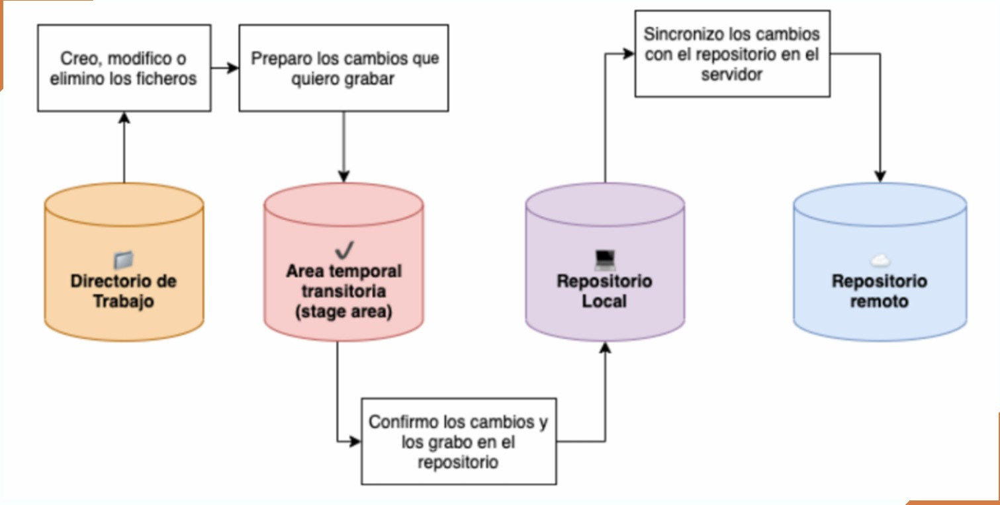
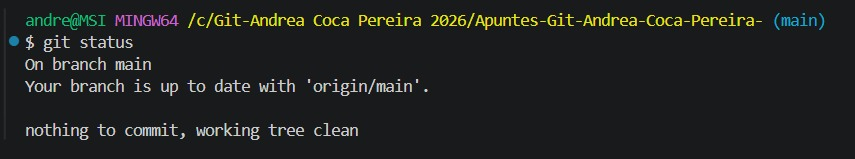
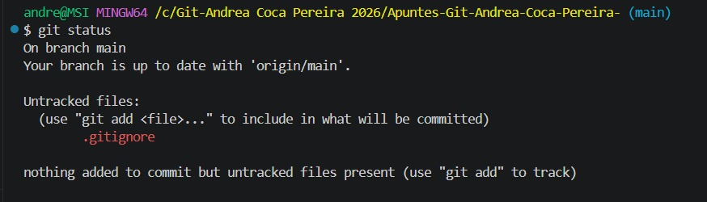
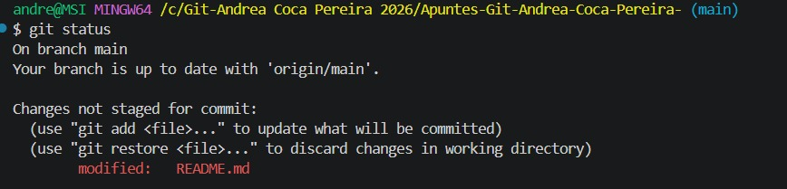
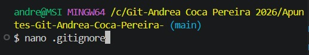
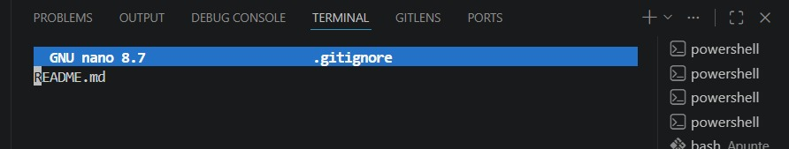
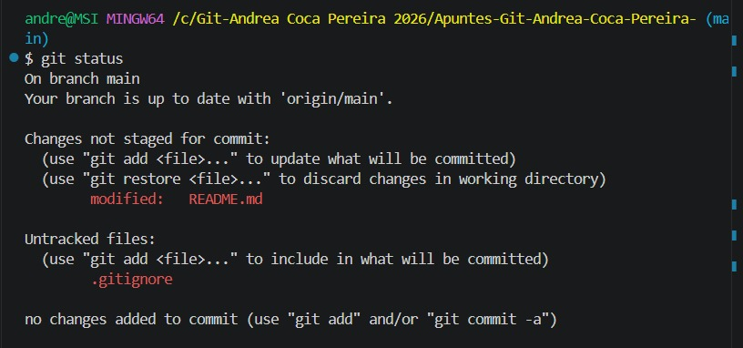
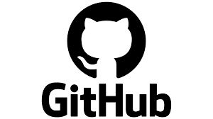
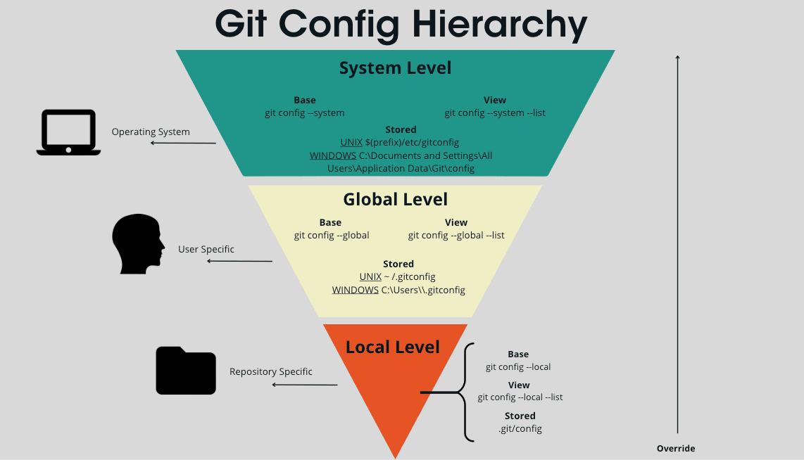

## Clase 2 - 21 de abril 2026

### Diagrama del flujo de Git


Git tiene 3 formas de gestionar cada archivo:
---

### 1. Modificado (Directorio de trabajo)
Es el lugar donde implementamos nuestro código o trabajo, 
acá simplemente Git observa tus archivos, los cuales los cataloga en:

- **Untracked:** Sin seguimiento, es cuando un archivo es nuevo, 
por lo cual Git aún no los conoce.
- **Modified:** Son archivos que Git ya conoce pero que modificaste 
(cambiar nombre y eliminar el archivo), entonces los pone como un track, 
esto se refiere a que es algo nuevo que no tiene en su historial.


---

### 2. Stage Area
Es el área de espera, es la zona donde ponemos los archivos que deseamos guardar.

Permite seleccionar qué archivos modificados se incluirán en el siguiente commit y cuáles no.

Para agregar un archivo al stage area:
```bash
git add <archivo>   # Agrega un archivo específico
git add .           # Agrega todos los archivos
```

Para sacar un archivo del stage area:
```bash
git restore --staged <archivo>
```
Si no colocas `--staged`, los cambios 
se **borran completamente** y vuelve a la última versión del commit
---

### 3. Repositorio Local (Confirmado)
Acá es cuando una vez que indicamos qué es lo que queremos guardar, 
Git va a crear en base a esos archivos el punto de guardado, 
una vez hecho esto pasa a lo que es el historial.
Es la última fase, aquí le decimos a Git que cree el punto de guardado para que todos los cambios en staged pasen a ser parte del historial.

```bash
git commit -m "mensaje"
```

Para deshacer el último commit:
```bash
git reset --soft HEAD~1
```
---

### Comando para ver en qué fase está cada archivo:
```bash
git status
```
---
working tree clean significa que todos los archivos de mi directorio de trabajo están en el mismo estado que el último commit.



---
Este git status muestra que:
Untracked files: .gitignore" significa que tengo un archivo nuevo (.gitignore) que Git detecta pero aún no rastrea, es decir está en el Directorio de Trabajo en estado Untracked.



---
Este git status muestra:
Changes not staged for commit: modified: README.md" significa que el archivo README.md fue modificado pero aún no está en el Stage Area, es decir está en el Directorio de Trabajo en estado Modified.



---

`.gitignore` es un archivo donde puedes listar los archivos o carpetas que **no quieres** que Git rastree ni suba a GitHub.







---
Si me equivoqué de modificar algo o cambiar, puedo restaurar la última versión antes de modificar, también puedes recuperar archivos borrados que hayan estado en seguimiento con:

```bash
git restore Nombre del archivo
```
---
## Buenas Prácticas en los Commits

### ¿Cada cuánto debo hacer un commit?
Es mejor hacer commits pequeños y frecuentes que uno con todo, 
a esto se le llama **commits atómicos**, donde cada commit representa 
un único cambio lógico y completo.

### ¿Cómo escribir un buen mensaje de commit?

- Usa **verbos imperativos:**

| Verbo | Significado |
|---|---|
| `Add` | Se añade un nuevo archivo |
| `Change` | Se modifica un archivo existente |
| `Fix` | Se arregla un bug |
| `Remove` | Se elimina un archivo |

- Usa **máximo 50 caracteres**
- **No uses punto final** ni puntos suspensivos
- Usa un **prefijo** para hacerlos más semánticos:

```bash
git commit -m "feat: Add new search feature"
```

### Prefijos:

| Prefijo | Uso |
|---|---|
| `feat` | Nueva característica |
| `fix` | Bug que afecta al usuario |
| `docs` | Cambios en documentación |
| `style` | Cambios de formato |
| `refactor` | Refactorización de código |
| `test` | Tests |
| `perf` | Mejoras de rendimiento |
| `build` | Cambios en el sistema de build |
| `ci` | Integración continua |

# GITHUB 
## Clase 3- 22 de abril 2026

---

## ¿Qué es GitHub?

GitHub es una plataforma en la nube y red social para desarrolladores
que permite alojar, gestionar y colaborar en proyectos de software
utilizando Git.

### Git vs GitHub

- **Git** — Crea los commits en mi máquina local.
- **GitHub** — Servidor donde esos commits se almacenan y comparten.
- GitHub usa Git, pero **no son lo mismo**.

---

## SSH vs HTTPS

### HTTPS 
Cuando clonás con HTTPS, GitHub te pide autenticarte cada vez
(usuario, contraseña o token). 

### SSH 
Configuras una clave en tu PC una sola vez, la registrás en GitHub,
y nunca más te pide contraseña.

> **Nota: siempre usa SSH.**

---

## Configuración SSH

**Paso 1 — Generar la clave**
```bash
ssh-keygen -t ed25519 -C "tu-correo@email.com"
```

**Paso 2 — Ver tu clave pública**
```bash
cat ~/.ssh/id_ed25519.pub
Copia todo el texto que aparece
```

**Paso 3 — Registrarla en GitHub**

Perfil → Settings → SSH and GPG Keys → New SSH Key → pegás la clave → Add SSH Key

**Paso 4 — Verificar la conexión**
```bash
ssh -T git@github.com
```

---

## Crear un repositorio en GitHub

1. Vas a `github.com/Tu-user?tab=repositories` haces clic en **New**
2. Ponés nombre y descripción haces clic en **Create Repository**

---

## Conectar repo local con GitHub

> **Requisito:** ya tienes `git init` y al menos un commit.

```bash
git remote add origin git@github.com:TuUser/TuRepo.git

git branch -M main

git push -u origin main

```

---

## Clonar un repositorio

```bash
Con SSH 
git clone "git@github.com:TuUser/TuRepo.git"

Si clonaste con HTTPS por error:
git remote set-url origin "git@github.com:TuUser/TuRepo.git"

ver a qué remote está conectado tu repo:
git remote -v
```

---

## Push y Pull

```bash
Subir tus commits a GitHub
git push origin <rama>

Bajar commits de GitHub
git pull origin <rama>
```

---

# Apuntes — Git Clase 4: Remote, SSH Múltiple y Checkout

---

## 1. Git Remote

`git remote` es el comando que gestiona las conexiones entre tu repositorio local y los repositorios remotos (ej. GitHub). Le dice a Git **dónde enviar** o **de dónde traer** información.

### Comandos útiles

| Comando | Descripción |
|---|---|
| `git remote -v` | Muestra las URLs exactas a donde apunta el repositorio |
| `git remote add <apodo> "url"` | Vincula el repo local con uno en la nube |
| `git remote set-url <apodo> "url"` | Cambia la URL a donde apunta el repositorio |

---

## 2. Múltiples SSH

Cuando tienes **más de una cuenta de GitHub**, necesitas una llave SSH por cuenta. Cada llave es un túnel independiente; si una llave accediera a múltiples cuentas, la seguridad estaría comprometida.

### Pasos para configurar múltiples SSH

**Paso 1 — Generar la nueva llave con un nombre distinto:**
```bash
ssh-keygen -t ed25519 -C "micorreo@gmail.com" -f ~/.ssh/id_miname
```

**Paso 2 — Crear/editar el archivo `~/.ssh/config` para evitar conflictos:**
```
# Cuenta Personal (la de siempre)
Host github.com
  HostName github.com
  User git
  IdentityFile ~/.ssh/id_ed25519

# Cuenta secundaria
Host github-miname
  HostName github.com
  User git
  IdentityFile ~/.ssh/id_miname
```
Solo cambia el HostName para evitar confusiones, también cambia lo q es el IdentityFile.

**Paso 3 — Verificar que funciona:**
```bash
ssh -T git@github-miname
```

### ¿Qué significa cada campo del config?

| Campo | Descripción |
|---|---|
| `Host` | Apodo/alias de la conexión (lo que escribes después de `git@`) |
| `HostName` | Dirección real del servidor (siempre `github.com`) |
| `User` | Usuario del sistema remoto (para GitHub, siempre es `git`) |
| `IdentityFile` | Ruta exacta a la llave privada que se usará para ese Host |

> **Importante:** Al clonar un repo con la cuenta secundaria, usa el Host correcto:
> ```bash
> git clone git@github-miname:usuario/repo.git
> ```

---

## 3. Configuraciones Locales de Git

cuando tu realizas el push, esos cambios se suben con tu usuario, que lo definiste de manera global, pero que pasa si no queremos subir nuestros cambios con ese usuario, simplemente quitas el ```--global``` y estarías usando un usuario local.
Comandos:
```
git config user.name "Mi nuevo Name"
git config user.email "micorreo@gmail.com"
```

---

### Jerarquía de configuraciones (de mayor a menor prioridad)
```
Local  (por repositorio)  ← mayor prioridad
  ↓
Global (por usuario)
  ↓
System (todo el sistema)  ← menor prioridad
```

---

## 4. Git Checkout

`git checkout` mueve el **HEAD** (el puntero/lector actual) a un punto específico del historial o a una rama distinta.

### ¿Para qué sirve?

- **Inspeccionar** → Ver cómo era el código en un commit antiguo
- **Restaurar** → Recuperar archivos borrados o modificados
- **Experimentar** → Probar cambios sin afectar la rama principal
- **Cambiar de rama** → Saltar de `main` a `desarrollo`, por ejemplo

### ¿Cómo ir y volver de un commit?

```bash
# Ir a un commit antiguo
git checkout <hash_antiguo>

# Volver al último commit de la rama
git checkout <nombre_rama>
```

Si hiciste un commit en estado detached y no quieres perderlo:
```bash
git checkout <hash_commit_creado>
git checkout -b rama_nueva
```

## 5. Estado "Detached HEAD"

En condiciones normales, **HEAD apunta a una rama** (que avanza con cada commit). En estado **Detached HEAD**, HEAD apunta directamente a un commit fijo.

Es como ser un **espectador en el pasado**: puedes ver y hacer cambios, pero si te vas sin "encarnar" en una rama, esos cambios se pierden.

---

## 6. Buenas Prácticas del Checkout

| Práctica | Detalle |
|---|---|
|  **Limpia tu directorio de trabajo** | Haz commit de los cambios actuales antes de viajar al pasado, o Git no te lo permitirá |
|  **No trabajes mucho tiempo en Detached HEAD** | Si vas a escribir más de dos líneas, crea una rama directamente |
|  **Úsalo para aprender** | Hacer checkout a commits de proyectos grandes es excelente para entender cómo evolucionaron |

# Clase 5 - 27 de abril del 2026
## Ramas y Gitflow Básico


## ¿Qué son las Ramas?

Las ramas son una de las principales utilidades de Git para llevar un mejor control del código. Se trata de una **bifurcación del estado del código** que crea un nuevo camino para la evolución del proyecto, en paralelo a otras ramas que se puedan generar.

---

## Comandos de Gestión de Ramas

### `git branch`

Permite gestionar las ramas del proyecto.

| Comando | Descripción |
|---|---|
| `git branch` | Lista las ramas disponibles que tengamos |
| `git branch <rama>` | Crea una rama a partir de la rama actual |
| `git branch -D <rama>` | Borra la rama |

---

### `git checkout` enfocado en ramas

`git checkout` nos permite ver anteriores commits, ver codigo pasado, entre otro, pero nos enfocaremos en ramas:

| Comando | Descripción |
|---|---|
| `git checkout <rama>` | Cambia a otra rama. No debe haber archivos en modified/untracked o staged |
| `git checkout -b <rama>` | Crea la rama **X** te mueve a ella directamente |

---

### `git checkout` vs `git switch`
git switch hace lo mismo que git checkout,tambien nos permite crear y movernos directamente a esa rama, pero no puede ir al pasado.

| | `git checkout` | `git switch` |
|---|---|---|
| **Uso** | Multipropósito (Ramas, Commits, Archivos) | Especializado únicamente en ramas |
---

## Gitflow Básico

### ¿Qué es?

Es un **flujo de trabajo (workflow)** que permite trabajar de manera ordenada con ramas, a través de consignas y reglas establecidas. Facilita el trabajo con versiones y la incorporación de nuevos colaboradores al proyecto.

### Ramas principales

| Rama | Descripción |
|---|---|
| `main` | Contiene el código en **producción**, es decir es el codigo que funciona. Es la rama por defecto al crear un repositorio. |
| `develop` | Rama de **pre-producción**. Contiene características que se están probando pero aún no han sido validadas del todo. Es donde más se trabaja en el día a día. |

### Ramas de apoyo

#### `feature/*`
- **Propósito:** Desarrollar una nueva característica para el proyecto, para ello se crea una rama para esa caracteristica.
- **Nace de:** `develop`
- **Muere en:** `develop` (se fusiona y se elimina)
- **Ejemplos de nombres:**
  ```
  feature/sum-function
  feature/add-search-bar
  feature/new-form-user
  ```

#### `release/*`
- **Propósito:** Preparar el lanzamiento de una nueva versión. Es donde se hacen las pruebas (QA).
- **Nace de:** `develop`
- **Muere en:** `develop` y `main`


#### `hotfix/*`
- **Propósito:** Trabajar en cambios imprevistos (parches para bugs en producción). Se crea desde `main` porque `develop` puede tener cambios inestables.


---
# Clase 7- 29 de abril del 2026
## Pull Requests (PRs)

Un **Pull Request** (PR) es la forma profesional de trabajar con Git/GitHub. Permite crear una solicitud en el repositorio de GitHub para proponer la unión (_merge_) de tu rama al código base principal, dándole al equipo la oportunidad de revisar y aprobar los cambios antes de integrarlos.

---

## ¿Por qué usar PRs?

Sin PRs, cualquier colaborador puede pushear y mergear código sin avisar.
Los PRs **obligan al equipo a ver los cambios**, limitan la colaboración y fuerzan el debate y la deliberación. Permiten entender qué se va a poner en marcha, quién lo hará, y presentar opiniones u oponerse al cambio. En resumen: mejor manejo grupal del repositorio.

---

## ¿Cómo crear un PR?

Una vez que hiciste `git push origin rama`, sigue estos pasos en GitHub:

1. Ve a la página principal de tu repositorio en GitHub.
2. Verás un banner amarillo que dice que tu rama tuvo cambios recientes. Haz clic en **"Compare & pull request"**.
3. Asegúrate de que el dropdown **base:** apunte a la rama donde quieres mergear (generalmente `develop` o `main`).
4. Asegúrate de que el dropdown **compare:** apunte a tu rama con los cambios.
5. Escribe un **título** y una **descripción** explicando qué cambiaste y por qué.
6. Haz clic en **"Create pull request"**.

A partir de ahí, tu equipo puede revisar los cambios, dejar comentarios y aprobar o pedir modificaciones. Una vez aprobado, se hace clic en **"Merge pull request"** para integrar los cambios.

---

## Flujo de trabajo con PRs

```bash
1. Situarte en develop y actualizar
git checkout develop
git fetch
git pull origin develop

2. Ir a tu rama (usa -b si la estás creando nueva)
git checkout -b mi-rama

3. Sincronizar cambios de develop (solo si hubo cambios)
git merge develop

4. Trabajar en tu rama...

5. Subir cambios (usa -u la primera vez)
git push -u origin mi-rama

# --- Antes de abrir el PR ---

6. Volver a sincronizar con develop por si hubo cambios nuevos
git checkout develop
git fetch
git checkout mi-rama
git merge develop

7. Resolver conflictos manualmente si los hay, luego:
git add .
git commit
# Guardar en nano: Ctrl+O → Enter → Ctrl+X

git push origin mi-rama

8. Abrir el PR en GitHub (ver pasos de arriba)
```

---

## ¿Cómo proteger el repositorio y limitar la colaboración?

Conocer la importancia de los PRs no es suficiente: sin configurar restricciones, los colaboradores aún pueden mergear sin aprobación. Para forzar que todo pase por un PR revisado, hay que crear una **regla de protección de rama**:

1. Ve a tu repositorio en GitHub y entra a **Settings**.
2. En el menú lateral, haz clic en **Branches**.
3. En la sección "Branch protection rules", haz clic en **Add rule**.
4. En el campo **Branch name pattern** escribe el nombre de la rama a proteger (por ejemplo `main` o `develop`).
5. Activa la opción **"Require a pull request before merging"**.
6. Activa **"Require approvals"** y elige cuántas aprobaciones se necesitan antes de poder mergear.
7. Opcionalmente activa **"Dismiss stale pull request approvals when new commits are pushed"** para que si alguien pushea nuevos cambios, las aprobaciones anteriores se invaliden y haya que volver a aprobar.
8. Haz clic en **Create** o **Save changes**.

A partir de ahí, nadie podrá mergear directamente a esa rama sin pasar por un PR aprobado.

---

## ¿Cómo colaborar sin ser colaborador invitado?

Esto es lo que Andre demostró en clase: se puede contribuir a **cualquier repositorio público sin necesitar invitación**, usando el modelo **Fork & Pull Request**.

Un **fork** es una copia completa del repositorio original en tu propia cuenta de GitHub. Desde ese fork trabajas libremente y luego propones tus cambios al repo original mediante un PR.

### Pasos

**1. Hacer fork**

En el repositorio original, presionar el botón **Fork** (esquina superior derecha). GitHub crea una copia en tu cuenta (`tu-usuario/nombre-repo`).

**2. Clonar tu fork y agregar el remoto upstream**

```bash
git clone https://github.com/tu-usuario/nombre-repo.git
cd nombre-repo
git remote add upstream https://github.com/owner-original/nombre-repo.git
```

`upstream` es el nombre que le damos al repositorio original. Lo necesitamos para mantener el fork actualizado.

**3. Crear tu rama, trabajar y pushear**

Trabajas normalmente en tu rama y haces push a tu fork, no al original (no tienes acceso de escritura allá).

```bash
git checkout -b mi-rama
# ... trabajas ...
git push -u origin mi-rama
```

**4. Abrir el PR hacia el repositorio original**

1. Ve a tu fork en GitHub.
2. Haz clic en **"Compare & pull request"**.
3. Asegúrate de que **base repository** apunte al repo original y **head repository** sea tu fork.
4. Escribe título y descripción, y haz clic en **"Create pull request"**.

El dueño recibirá una notificación, revisará los cambios y decidirá si los acepta o pide modificaciones.

**5. Mantener el fork actualizado mientras el PR está abierto**

```bash
git fetch upstream
git rebase upstream/main
# Si hay conflictos: resolverlos → git add <archivo> → git rebase --continue
git push --force-with-lease
```

Cualquier nuevo commit que hagas en tu rama se refleja automáticamente en el PR abierto. No necesitas cerrar y abrir uno nuevo.